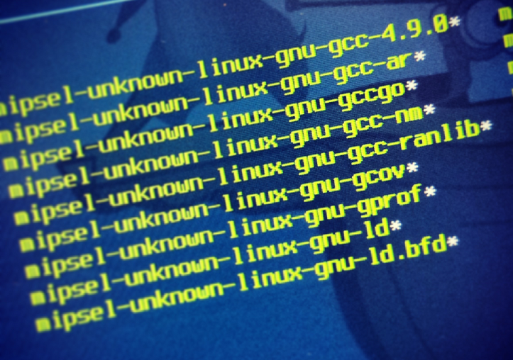

# ewxb - Erik Westrup's GCC cross-compiler builder

This is a script documenting the steps and phases take when I compiled a GCC cross toolchain for GCC 4.9 head (with Go support). Building a cross-compiler is complex due to dependencies so a lot of bootstrapping has to be done. This script is inspired by Jim Blandy's excellent eglibc cross-compiling guide posted at eglibc's mailinglist at [\[patches\] Cross-building instructions](http://www.eglibc.org/archives/patches/msg00078.html).

This script can serve as a starting point for those who want to build a x-toolchain from scratch. Don't expect it to work in directly as it's tailored for my setup. Instead you can re-use the phases and modify the script with parameters that you need. The last phases adds Go support, which is easy to comment out if you're only interested in a C/C++ compiler.

My setup was:

* Host/Build system: Linux 3.2.0-4-amd64 #1 SMP Debian 3.2.54-2 x86_64 GNU/Linux
* Target: mips
* gcc: 4.9.0
* glibc: 2.19
* binutils: 2.24

The scripts makes it easy to run specific phases (or range of phases) so that you easly can tweak a failing phase and continue with the ones that follows when you have got one phase to work. Make sure to edit [x_environment.sh](x_environment.sh) to the right versions of the packages and build paths to use.

For any details, simply read the [sauce](ewxb).

More info about using Go with a gccgo cross-compiler can be found at the [go-wiki](http://code.google.com/p/go-wiki/wiki/GccgoCrossCompilation).

The sweet result after playing some Rube Goldberg trickery games.
